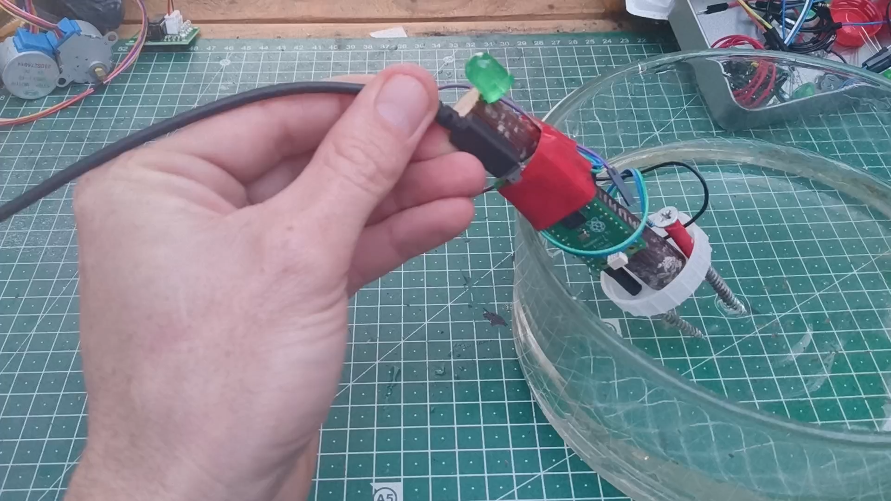

## What you will make

A soil moisture sensor to check how dry the soil is. It warns the user with a light. When the soil becomes too dry, the light turns on to show that the plant needs water.

--- print-only ---

--- /print-only ---

--- no-print ---

[Editor embed](https://editor.raspberrypi.org/en/embed/viewer/project-slug)

--- /no-print ---

--- no-print ---

<html>

<iframe style="position: absolute; top: 0; left: 0; right: 0; width: 100%; height: 100%; border: none;" src="https://www.youtube.com/embed/sh4gyo-vds8?rel=0&cc_load_policy=1" allowfullscreen allow="accelerometer; autoplay; clipboard-write; encrypted-media; gyroscope; picture-in-picture; web-share">
</iframe>

 
</html>

--- /no-print ---

### You will need:

**For the circuit:**
- Raspberry Pi Pico
- Pin-pin jumper wires
- Terminal block
- 10kΩ or 11kΩ resistor
- LED (any color)
- 5V USB power or battery pack (optional)

**For the soil probe:**
- Two metal screws
- Material to hold the screws (bottle lid, yoghurt cup, popsicle stick, or scrap wood)
- Scissors
- Pen?
- Handle material (such as…..
- Wire stippers?
- Glue / tape?
- Pin-socket jumper wires 

