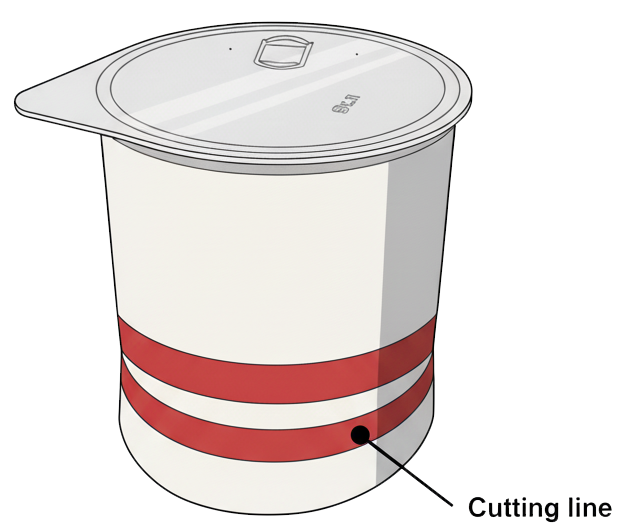
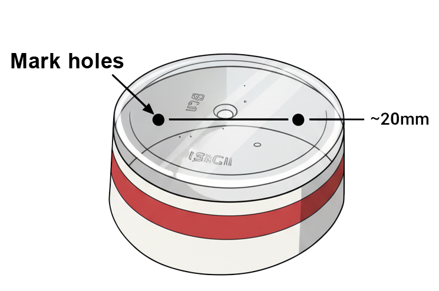
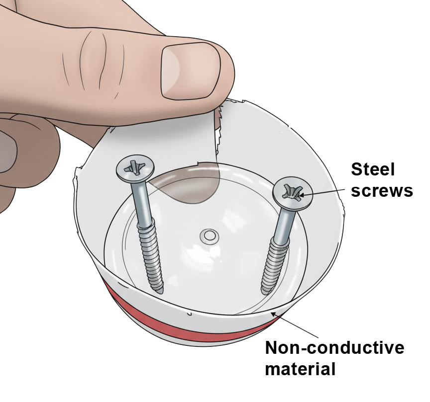
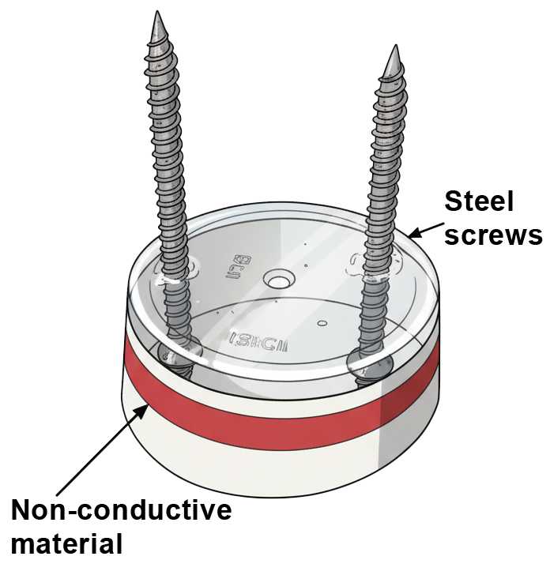
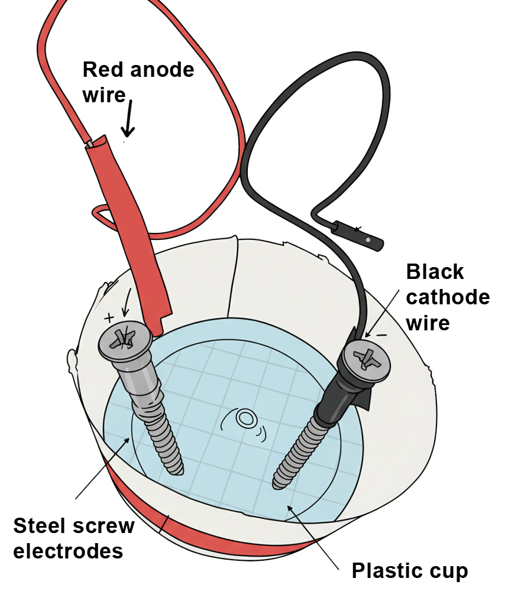
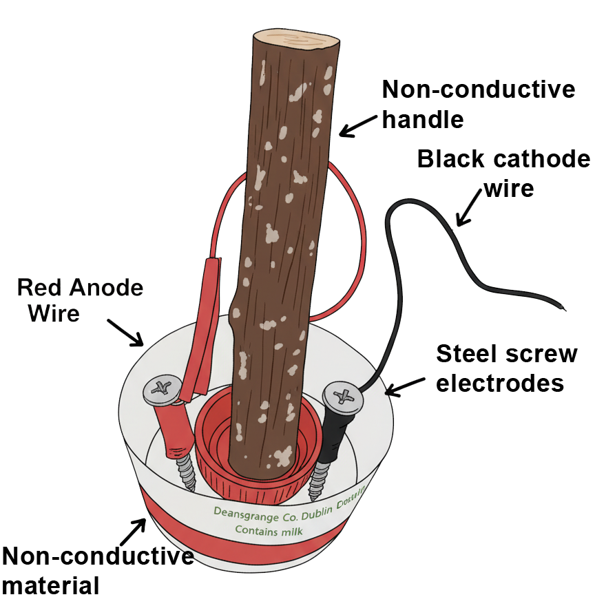

## Build the Soil Probe

Create the frame that will hold the sensor screws apart at a set distance.

--- task ---

Choose an old container lid, bottle cap, popsicle stick, or another non-conductive material that is strong enough to hold two screws. 

This example uses an old plastic yogurt pot.

--- /task ---

--- task ---

Use a ruler to mark two spots on the plastic surface, spaced around 2 centimetres apart.

--- /task ---

--- task ---
 
Create holes at the marked points by tightening the screws through the spots so that the tips extend evenly on the underside and the heads sit on top.
{:width="300px"}

--- /task ---

--- task ---

Check that the screw heads and threads stay apart from each other. They should be separate so that no electricity can pass between them.
{:width="300px"}

--- /task ---

--- task ---

Mark one screw as **Probe A** and the other as **Probe B**. 

--- /task ---

--- task ---

Remove the socket connector from some socket-pin jumper cables and tape or solder the stripped ends to the screws. The pin ends will connect the screws to your breadboard.
{:width="300px"}

--- /task ---

--- task ---
 
Fix a handle (for example, a yoghurt-cup stick, plastic straw, or short wooden dowel) to the top of the plastic base using tape or glue so your new *probe* can be inserted into soil safely.
{:width="300px"}

--- /task ---