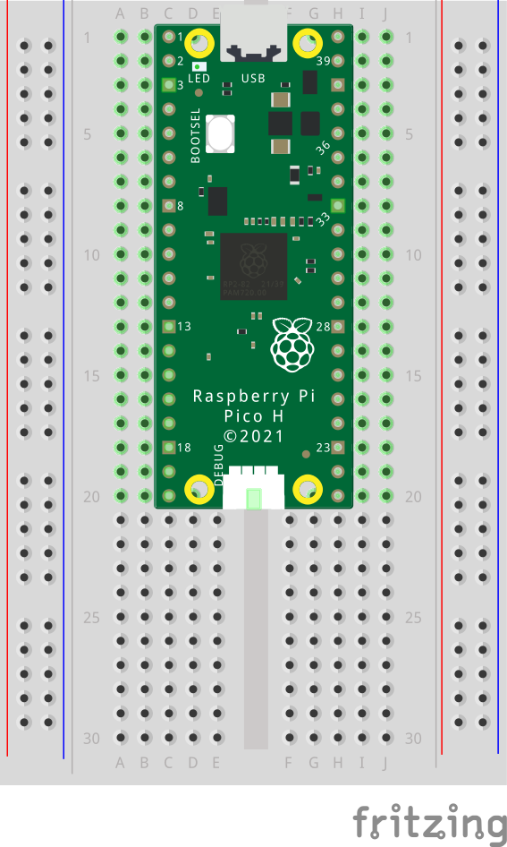
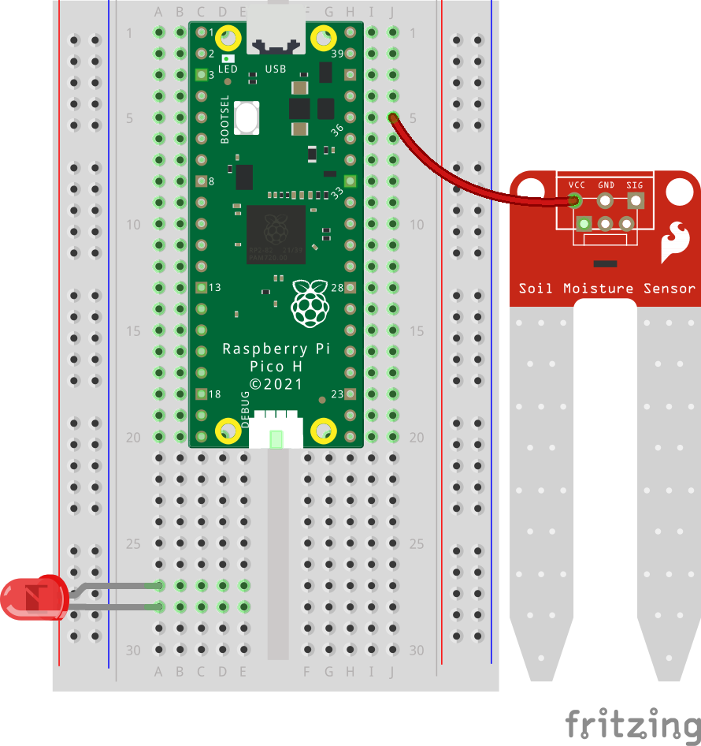
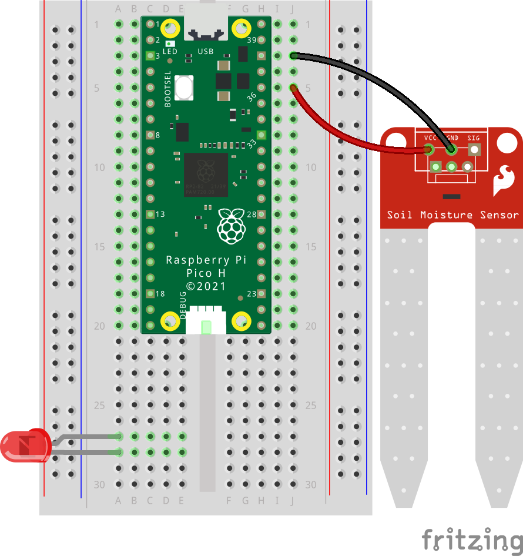
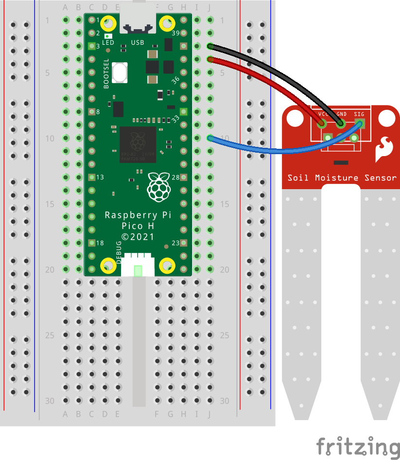
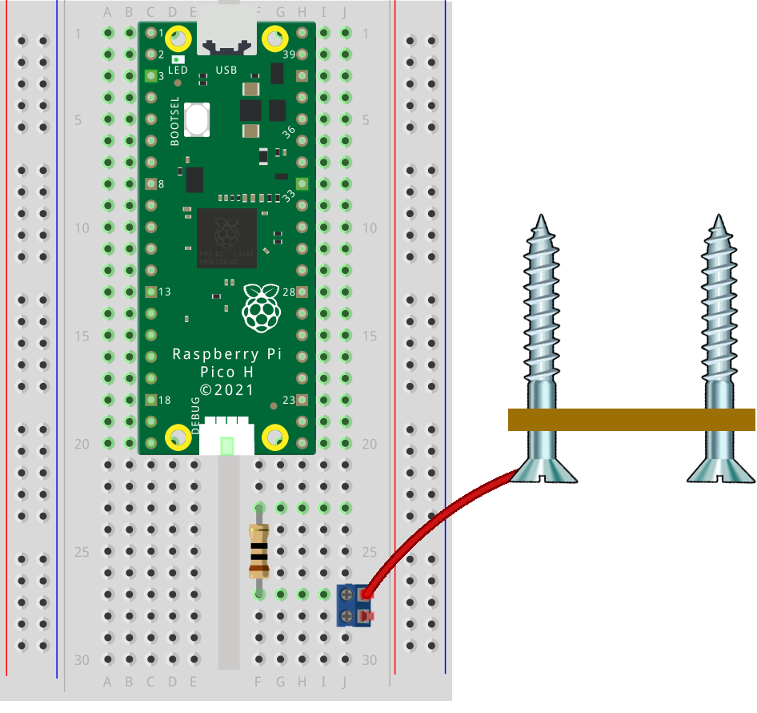
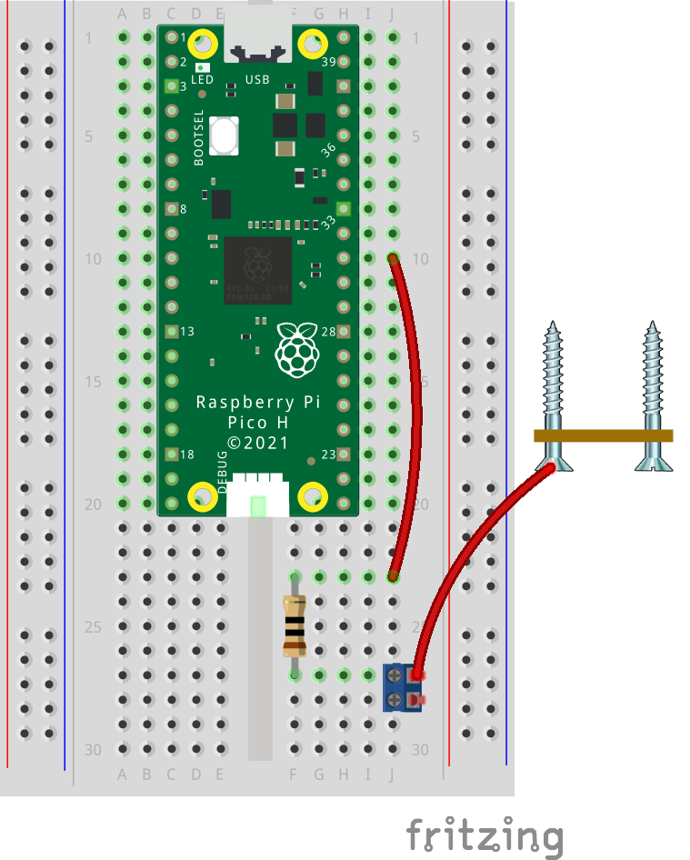
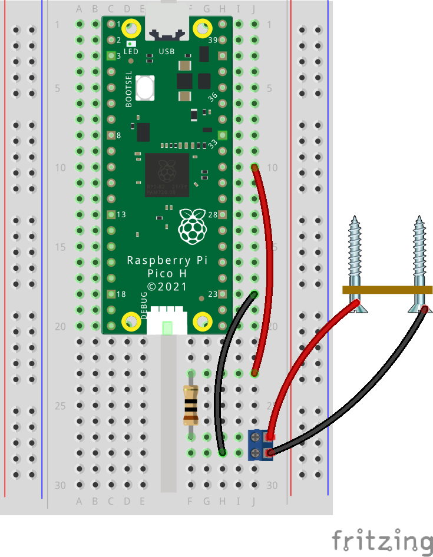

## Wire the Sensor Circuit

Connect the probe to the pins on the Pico so you can measure the resistance of the soil.

--- task ---
 
Set the Raspberry Pi Pico securely on a breadboard or workspace so you can easily access all pins for wiring.

--- /task ---

--- collapse ---

---

title: I have a moisture probe component - I don't want to use screws!

---

The moisture probe component requires a power suppply to work. Follow these instructions to substitute the moisture probe for the two-screws probe example:

--- task ---

Connect the **VCC** pin on the soil moisture sensor to the **3V3 (OUT)** pin on the Raspberry Pi Pico (pin 36). This provides the sensor with a 3.3V power supply. 
{:width="300px"} 

--- /task ---

--- task ---

Connect the **GND** pin on the soil moisture sensor to one of the **GND** pins on the Pico (pin 38). This completes the power circuit.  
{:width="300px"}

--- /task ---

--- task ---

Attach a jumper wire from the **SIG** (signal) pin on the soil moisture sensor to **Pin 31 (GP26 / ADC0)** on the Pico. This allows the Pico to read the analogue signal representing soil moisture. 
{:width="300px"} 

--- /task ---

--- task ---

**Test:** Make sure there are no short circuits or broken connections:  
- Gently move each jumper and connection to check there is a firm connection between the pins and breadboard.
- Double-check that the probe doesn't contact the Pico board or any metal parts of your workspace.

--- /task ---

--- task ---

[Follow the rest of the instructions as normal on the **next step**](https://projects.raspberrypi.org/en/projects/pico-probe/3){:target="_blank"}!

--- /task ---

--- /collapse ---

--- task ---
 
Join a wire from **Probe A** to one end of a **10 kΩ resistor**; with a **terminal block** in the breadboard.
{:width="300px"}

--- /task ---

--- task ---
 
Attach the free end of the resistor to **Pin 31 (GP26 / ADC0)** on the Pico. This pin reads the changing voltage from the probe.
{:width="300px"}

--- /task ---

--- task ---

Attach a jumper wire from **Probe B** to one of the **GND** pins on the Pico to complete the ground connection.
{:width="300px"}

--- /task ---

--- task ---

**Test:** Make sure there are no short circuits or broken connections:  
- Confirm that **Probe A** and **Probe B** are not touching or connected through any conductive path.
- Gently move each jumper and connection to check there is a firm connection between the pins and breadboard.
- Double-check that the probe assembly and screws don't contact the Pico board or any metal parts of your workspace.

--- /task ---
