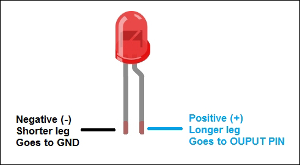
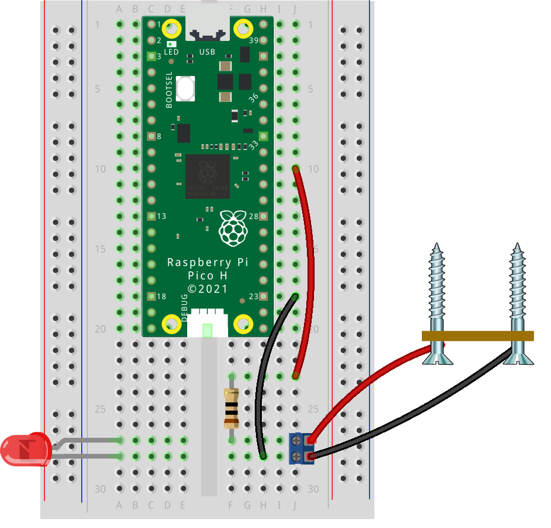
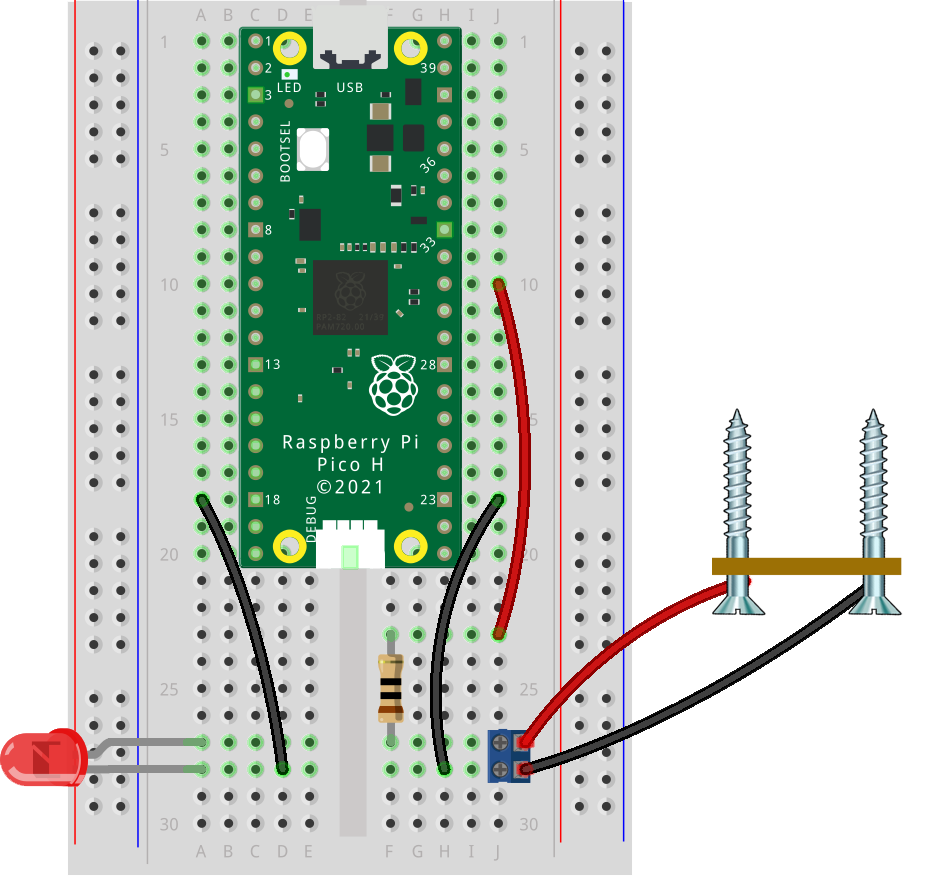
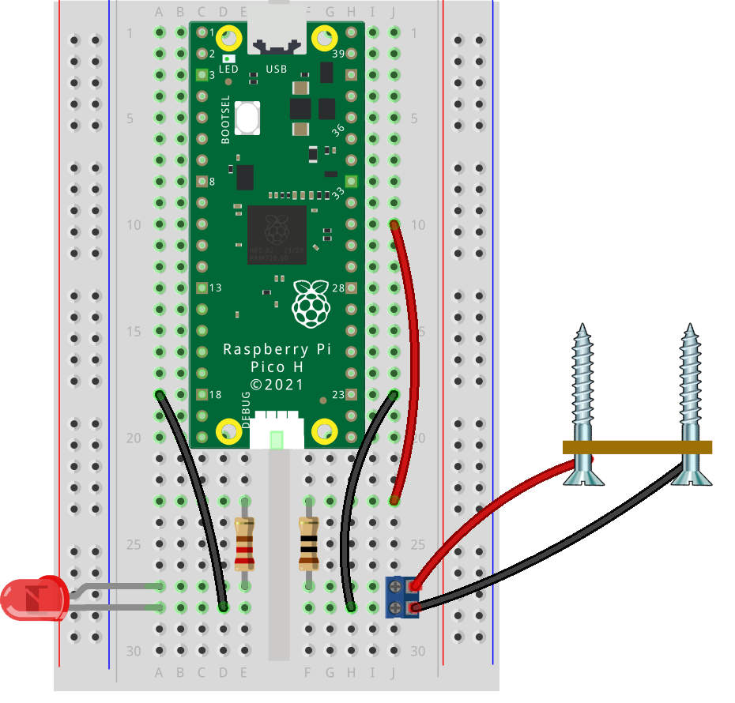
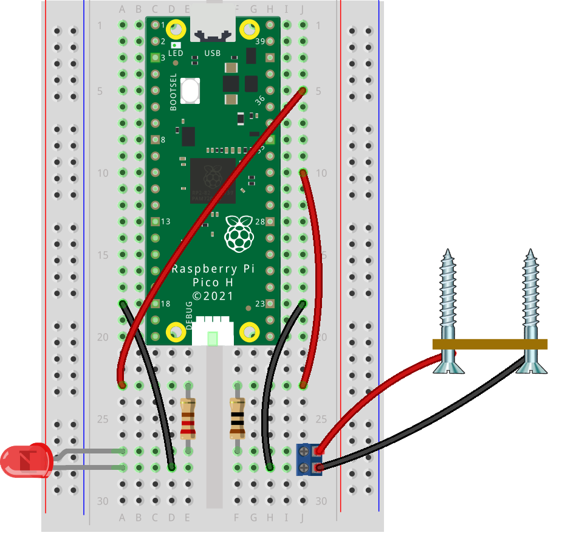
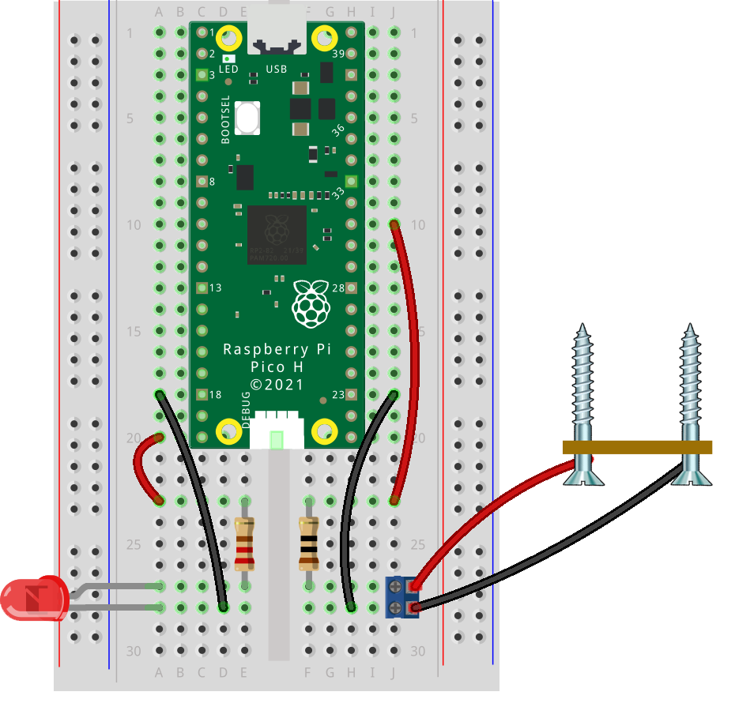

## Add the LED indicator

--- task ---

Check which leg of the LED is longer (anode, positive) and which is shorter (cathode, negative).

--- /task ---

--- task ---

Insert the LED into the breadboard: position the LED so that its legs are in separate rows and there is space to connect a resistor and jumper wires.
{:width="300px"}
--- /task ---

--- task ---

Connect the shorter leg of the LED to a **GND** pin on the Raspberry Pi Pico.
{:width="300px"}

--- /task ---

--- task ---
 
Connect the longer leg of the LED to one end of a **220Ω resistor**. This resistor will limit the current through the LED.
{:width="300px"}

--- /task ---

--- task ---

Use a jumper wire to connect the resistor to **3V3(OUT)** (pin **36**) to check that the LED lights up. This pin always puts out 3V.
{:width="300px"}

--- /task ---

--- task ---

If your LED does not light:
- Check that you have connected the LED's long leg to the resistor and its short leg to a **GND** pin — LEDs only work one way around
- Check that the LED is not damaged
- Check that the LED and resistor wiring are not interfering with the sensor circuit and that no components are shorted
- Replace the LED and check again

--- /task ---

--- task ---

Move the jumper wire connected to the resistor from pin **36** to **GP14** on the Raspberry Pi Pico. This pin will control the LED signal.
{:width="300px"}

--- /task ---

